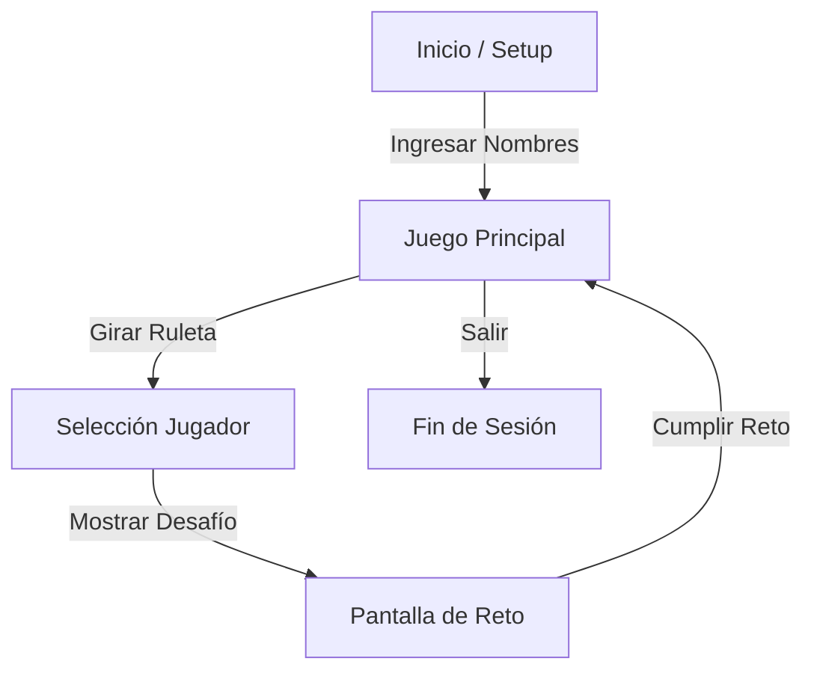

# Documento de Diseño de Juego (GDD) - Tomanji (Godot Remake)

| Información       | Detalle                                                             |
| ----------------- | ------------------------------------------------------------------- |
| **Título**        | Tomanji                                                             |
| **Género**        | Party / Drinking Game                                               |
| **Plataforma**    | Android / iOS (Vertical/Portrait recomendado para pasar el celular) |
| **Audiencia**     | Jóvenes adultos (18-35) en fiestas ("carretes")                     |
| **Engine**        | Godot 4.6                                                           |
| **Estilo Visual** | Neón Selvático (Jungle neon), Oscuro, Vibrante                      |
| **Input**         | Táctil (Un solo dedo)                                               |

## 1. Visión General

"Tomanji" es un juego de beber social donde los jugadores giran una ruleta que determina quién debe enfrentar un desafío. El objetivo es simple: sobrevivir al carrete, reírse de los amigos y beber. El juego fluye rápido, sin reglas complicadas.

### Pilares de Diseño

1.  **Inmediatez**: Configurar y jugar en menos de 1 minuto.
2.  **Socialización**: Todo ocurre fuera de la pantalla. La pantalla solo dicta la acción.
3.  **Estética "Carrete"**: Colores neón, fondo oscuro, feedback visual jugoso ("Juice").
4.  **Identidad Chilena**: Modismos y cultura local en los textos (sin marcas reales).

## 2. Flujo de Juego (Core Loop)

### Fases

1.  **Setup**:
    - Pantalla simple para agregar nombres de jugadores (Mínimo 2).
    - Asignación automática de colores a cada jugador.
    - Botón "¡A BEBER!" para iniciar.

2.  **Ronda (Main Game)**:
    - Se muestra la **Ruleta** con los nombres de los jugadores + segmentos "TODOS".
    - Botón grande "GIRAR".
    - Cualquier jugador presiona (o el jugador del turno anterior).
    - Animación de giro con sonido de "tik-tik-tik" acelerando y frenando.

3.  **Resolución (Challenge)**:
    - La ruleta se detiene en un jugador (Victima) o "TODOS".
    - Aparece un modal/popup estilizado ("Cartel de la Selva").
    - **Título**: Nombre del reto.
    - **Historia**: Breve texto de ambientación.
    - **Acción**: La instrucción directa (ej. "Tómate 3 sorbos al seco").
    - Botón "LISTO" para volver a la ruleta.

## 3. Dinámicas y Reglas

- **Jugadores**: 2 a 12+.
- **Turnos**: No hay un orden estricto de quién gira la ruleta, pero el juego lleva el control de quién es el "jugador activo" cíclicamente si se desea, aunque la ruleta decide la _víctima_.
- **Tipos de Segmentos**:
  - **Jugador Específico**: El reto va dirigido a quien salió sorteado.
  - **TODOS**: Un reto global (ej. "La Cascada", "Cultura Chupística").

## 4. Interfaz y Experiencia de Usuario (UI/UX)

- **Estilo**: Interfaz oscura (`#1a1005` o similar) con acentos verde neón (`#4d7c0f`) y amarillo (`#facc15`).
- **Feedback**:
  - Sonidos al girar (haptic feedback si es posible en móvil).
  - Confeti o partículas al salir un reto.
  - Texto grande y legible (para gente que ya ha bebido).

## 5. Contenido (Retos)

El juego se alimenta de una base de datos de retos categorizados (aunque para el MVP se eligen aleatoriamente filtrando por tipo PLAYER/ALL).

- _Ver archivo separado `Content_Tomanji.md` para la lista completa._

## 6. Audio

- **Música**: Loop ambiental de selva/tambores tribales suave.
- **SFX**:
  - `Spin`: Sonido de ruleta mecánica.
  - `Win`: Sonido de éxito/jingle tribal al mostrar el reto.
  - `Click`: Interacción UI básica.
