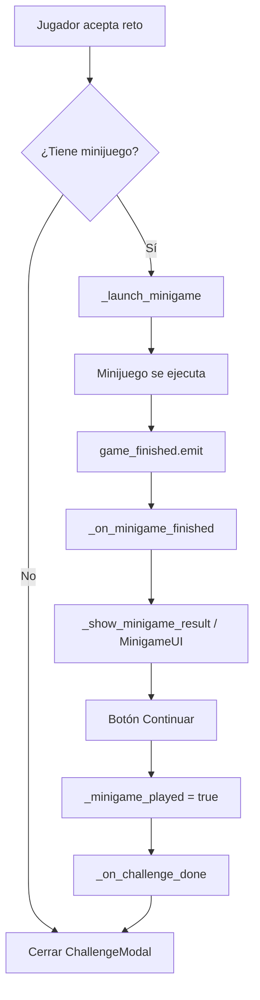

# Implementación de Minijuegos para Retos

Esta guía detalla el proceso completo para agregar un nuevo minijuego al sistema de retos.
Los minijuegos se activan cuando un jugador acepta un reto que tiene uno asignado.

## Arquitectura

```
challenges.json (data)
    └── challenge.minigame = { "type": "KEY", "rounds": 3 }

ChallengeManager.gd (formulario CRUD)
    ├── MINIGAME_KEYS   → ["", "HOCKEY", "FINGER", ...]
    └── MINIGAME_LABELS → ["Ninguno", "🏒 Air Hockey", "👇 Último Dedo", ...]

Main.gd (orquestador)
    ├── _launch_minigame()       → instancia el minijuego según "type"
    ├── _on_minigame_finished()  → recibe winner_idx, limpia minijuego
    └── _show_minigame_result()  → muestra MinigameUI (ganador/perdedor)

NuevoMinigame.gd (script del minijuego)
    ├── signal game_finished(winner_idx: int)
    ├── vars: player1_name, player2_name, player1_color, player2_color
    └── UI construida enteramente en código (_draw)
```

## Flujo del Minijuego



---

## Paso 1: Crear el Script del Minijuego

Crear `res://scripts/NuevoMinigame.gd` siguiendo este esqueleto:

```gdscript
extends Control
## NuevoMinigame.gd — Descripción del minijuego.
## Built entirely via code. Emits game_finished(winner_idx) when done.

signal game_finished(winner_idx: int) # 0 = bottom/player1, 1 = top/player2

# --- Configuration (set before adding to tree) ---
var player1_name: String = "Jugador 1"
var player2_name: String = "Jugador 2"
var player1_color: Color = Color("#22c55e")
var player2_color: Color = Color("#ef4444")
# Agrega parámetros extra si es necesario (ej: rounds_to_win)

func _ready() -> void:
    set_anchors_and_offsets_preset(Control.PRESET_FULL_RECT)
    mouse_filter = Control.MOUSE_FILTER_STOP
    # Construir UI enteramente en código
    # ...

func _input(event: InputEvent) -> void:
    # Manejar touch + mouse fallback
    # Touch: InputEventScreenTouch, InputEventScreenDrag
    # Mouse: InputEventMouseButton, InputEventMouseMotion
    pass

# Cuando termine el juego:
# game_finished.emit(winner_idx)  # 0 o 1
```

### Reglas del Script

1. **Extiende Control** — no una Scene, es script-only
2. **Signal obligatoria**: `game_finished(winner_idx: int)` donde `0 = player1 (bottom)`, `1 = player2 (top)`
3. **Variables obligatorias**: `player1_name`, `player2_name`, `player1_color`, `player2_color`
4. **UI por código**: Todo se construye en `_ready()` usando `_draw()` o nodos creados desde código
5. **Fullscreen**: usar `set_anchors_and_offsets_preset(Control.PRESET_FULL_RECT)`
6. **Mouse filter**: `MOUSE_FILTER_STOP` para capturar todo el input
7. **Input dual**: Soportar **multitouch** (InputEventScreenTouch/Drag) **y mouse** como fallback para testing en desktop
8. **Orientación tabletop**: Jugador 1 abajo, Jugador 2 arriba (texto rotado 180° con `rotation = PI`)

### Ejemplos Existentes

| Minijuego   | Script              | Key      | Mecánica                                |
| ----------- | ------------------- | -------- | --------------------------------------- |
| Air Hockey  | `HockeyMinigame.gd` | `HOCKEY` | Puck physics, paddles, goals por rondas |
| Último Dedo | `FingerMinigame.gd` | `FINGER` | Touch simultáneo, countdown, reacción   |

---

## Paso 2: Registrar en Main.gd

### 2.1 Agregar preload

En `res://scripts/Main.gd`, junto a los otros preloads:

```gdscript
const NuevoMinigameScript := preload("res://scripts/NuevoMinigame.gd")
```

### 2.2 Agregar branch en `_launch_minigame()`

Dentro de la función `_launch_minigame()`, agregar un `elif` para el nuevo tipo:

```gdscript
func _launch_minigame(minigame_data: Dictionary) -> void:
    var mg_type: String = str(minigame_data.get("type", ""))
    var p1_color := _get_player_color(_current_winner_name, false)
    var p2_color := _get_player_color(_current_j2_name, false)

    if mg_type == "HOCKEY":
        # ... (existente)
    elif mg_type == "FINGER":
        # ... (existente)
    elif mg_type == "NUEVO_KEY":           # ← AGREGAR
        _current_minigame = Control.new()
        _current_minigame.set_script(NuevoMinigameScript)
        _current_minigame.player1_name = _current_winner_name
        _current_minigame.player2_name = _current_j2_name
        _current_minigame.player1_color = p1_color
        _current_minigame.player2_color = p2_color
        # Agregar parámetros extra si necesario:
        # _current_minigame.rounds_to_win = int(minigame_data.get("rounds", 3))
    else:
        return

    _current_minigame.game_finished.connect(_on_minigame_finished)
    _current_minigame.z_index = 50
    add_child(_current_minigame)
```

### 2.3 No modificar las demás funciones

Las funciones `_on_minigame_finished()`, `_show_minigame_result()` y `_handle_back()` son **genéricas** y ya manejan cualquier minijuego a través de `_current_minigame`. No necesitan cambios.

El nodo **MinigameUI** (declarado en `Main.tscn`) es la pantalla de resultado que muestra ganador/perdedor:

```gdscript
# Refs en Main.gd (ya existentes)
@onready var loser_label: Label = $MinigameUI/Container/VBox/LoserLbl
@onready var winner_label: Label = $MinigameUI/Container/VBox/WinnerLbl
@onready var minigame_success_button: Button = $MinigameUI/Container/VBox/Button
```

**Flujo automático**: `_on_minigame_finished` → `_show_minigame_result` → `MinigameUI` visible → Botón "Continuar" → `_minigame_played = true` → `_on_challenge_done()`

---

## Paso 3: Registrar en ChallengeManager

### 3.1 Agregar tipo en las constantes

En `res://scripts/ChallengeManager.gd`, agregar el key y label:

```gdscript
const MINIGAME_KEYS := ["", "HOCKEY", "FINGER", "NUEVO_KEY"]
const MINIGAME_LABELS := ["Ninguno", "🏒 Air Hockey", "👇 Último Dedo", "🆕 Nuevo"]
```

> [!IMPORTANT]
> El primer elemento (`""` / `"Ninguno"`) debe mantenerse siempre en posición 0.
> El key usado aquí debe coincidir exactamente con el branch en `_launch_minigame()`.

### 3.2 El dropdown se popula automáticamente

El `OptionButton` del formulario (`_minigame_option`) se llena en `_ready()`:

```gdscript
# Ya existente en _ready():
_minigame_option.clear()
for i in MINIGAME_LABELS.size():
    _minigame_option.add_item(MINIGAME_LABELS[i], i)
```

### 3.3 Formato JSON del challenge

El minijuego se guarda en el campo `"minigame"` del challenge en `challenges.json`:

```json
{
  "id": 700,
  "title": "Ejemplo",
  "action": "...",
  "minigame": {
    "type": "NUEVO_KEY",
    "rounds": 3
  }
}
```

- `type`: debe coincidir con `MINIGAME_KEYS` y el branch en `_launch_minigame()`
- `rounds`: parámetro opcional, usado por Hockey (best-of-N), ignorado por Finger

---

## Checklist Rápido

```
[ ] 1. Crear res://scripts/NuevoMinigame.gd
    [ ] Extiende Control
    [ ] signal game_finished(winner_idx: int)
    [ ] vars: player1/2_name, player1/2_color
    [ ] UI por código, fullscreen, mouse_filter STOP
    [ ] Input: touch + mouse fallback
    [ ] Emitir game_finished al terminar

[ ] 2. Registrar en res://scripts/Main.gd
    [ ] Agregar const preload del script
    [ ] Agregar elif branch en _launch_minigame()
    [ ] (NO tocar _on_minigame_finished ni _show_minigame_result)

[ ] 3. Registrar en res://scripts/ChallengeManager.gd
    [ ] Agregar key a MINIGAME_KEYS
    [ ] Agregar label a MINIGAME_LABELS
    [ ] (El dropdown se popula solo en _ready)

[ ] 4. Probar
    [ ] Crear challenge con el nuevo minijuego en el formulario
    [ ] Verificar que aparece al aceptar el reto
    [ ] Verificar game_finished → MinigameUI → continuar
    [ ] Verificar botón back bloqueado durante minijuego
```
